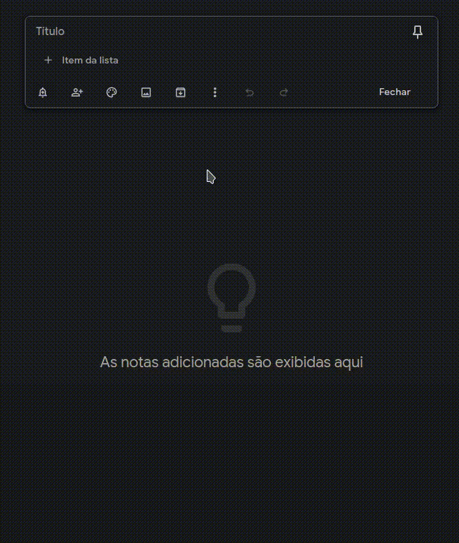

# keep-lists
A mini-clone of Google Keep lists!

## Objetivos básicos
- Listas ordenadas ou numeradas
- Re-ordenar elementos por drag
- Sincronizar com alguma API
- Agrupar e mover sub-listas junto com o item pai
- Filtrar itens concluídos

## Sonhos futuros
- Múltiplas listas
- Outros tipos de informação (imagens, links, vídeos)
- Integração com calendários
- App para mobile

## Referência do original
